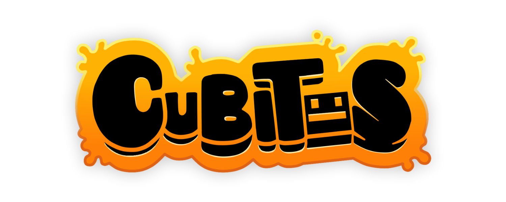

  <!-- // TODO: UPLOADING ASSETS-->
  <h1 align="center">Cubitos Team</h1>
  <h4 align="center">An indie fangame development team dedicated to delivering fresh and distinctive content, all with our signature touch of quality.</h4>
  <h4> </h4>

  
  
  

## Our Projects
<table>
  <tr>
    <td>
      <h1>Somi Engine</h1>
      <h3>The official Cubitos Team's engine</h3>
      Somi Engine is a versatile engine developed by the Cubitos Team, specifically designed for creating rhythm-based & platformer games like "Friday Night Dashing". Written entirely in Lua and built using the LÖVE 2D framework.
    </td>
    <td></td>
  </tr>
</table>
<table>
  <tr>
    <td>
      <h1>Friday Night Dashing</h1>
      <h3>Jump and Dash on a Friday Night!</h3>
        Friday Night Dashing is a Friday Night Funkin' fangame based on the story, levels and community of Geometry Dash.
    </td>
    <td></td>
  </tr>
</table>
<table>
  <tr>
    <td>
      <h1>I'M STILL HERE</h1>
      <h3>a Friday Night Funkin' one-shot</h3>
        I'M STILL HERE is a Friday Night Funkin' fangame based on Five Nights at Freddy's 3 where you sing against Springtrap. Built using <href="https://github.com/VanillaEngineDevs/Vanilla-Engine">Vanilla Engine</href>.
    </td>
    <td></td>
  </tr>
</table>
